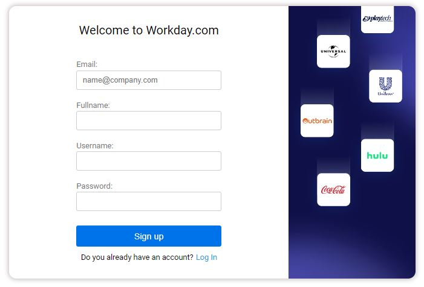

# Workday - pixel perfect, E2E clone of Monday (React + Node.js). 

Task management board app inspired by monday.com, [Here is my project link](https://workday.onrender.com/#/).


___

### Table of Contents
- [Monday Description](#monday-description)
- [Application Features](#application-features)
- [Technologies](#technologies)
- [Getting started](#getting-started)
- [Showcase](#showcase)

## Monday Description
Monday is an app in which you can manage projects and tasks using a Table or kanban board. A board contains groups and tasks. Usually each project is a board, and the groups group together tasks on the same topic that need to do in the project. Users can modify the board and change tasks locations using Drag and Drop.
Users can work together and watch live changes. 
There are many other features in Monday, such as status, priority, timeline for tasks, members and more. 
Every thing Monday has, we also had. More about it in the [features section](#application-features).

## Application Features
- Create ***Boards*** and manage projects: Using ***D&D***, create, remove, duplicate, and update boards, groups and tasks.
- Create, edit, duplicate and remove ***Task*** to the deepest level: Status, Priority, Timeline, Members, etc.
***Filtering*** by groups and tasks name (item), and ***Sorting*** by name(item), status, priority, last updated and timeline.
- Login with regular authentication which is encrypted and safe.

Of course that we included all the small nuances Monday has. You are not supposed to find any differences! 

## Technologies

The technology stack we used was MERN - MongoDB, Express, React, Node.js.
The app uses webSockets to update the board in real-time.
The API calls to the backend are done with the REST API method, and we used middlewares to authenticate and authorize actions.

We have used many libraries for many goals, such as the D&D and more.
The layout and pixel-perfect were made with Sass (functions, mixins, variables).

## Getting started

Head to the repository on top and clone the project or download the files.

```
git clone https://github.com/shaniamos/workday-backend.git
```

Also, clone the frontend folder [here](https://github.com/shaniamos/workday-frontend).

Enter the backend folder and make sure you have node_modules installed. After that we will initiate the server with 'npm start':

```
cd backend
npm i 
npm start
```

Enter the frontend folder and repeat the same process.

```
cd frontend
npm i 
npm start
```

That's it! The App should be opened automatically, enjoy!

## Showcase

### Homepage
The landing page in which the user can sign up / login, or press the call to action button to start demo if he is limited with time.


### Board
All the functionality that you have in Monday. D&D, live-updates, editing groups and tasks to the deepest level, side-menu, and much more.


### Kanban
Another view of the board. It has all the functionality, including D&D.


### Signup
We created an e2e authentication flow, including encrypting the users' details and middlewares.



### Some mobile!
Just a taste of the mobile experience. We used different **mixins**, **conditional rendering**, and the **"mobile first"** approach. 
The layout we have built from the very first moment enabled us to make the website responsive without a lot of effort.


### Authors
 - [Tal Elmaliach Hemo](https://github.com/TalElmaliachHemo)
 - [Shani Amos](https://github.com/shaniamos)
 - [Bar Mendel](https://github.com/barmendel123)
